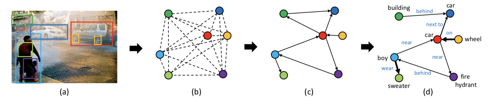

# graph-rcnn.pytorch
Pytorch code for our ECCV 2018 paper ["Graph R-CNN for Scene Graph Generation"](https://arxiv.org/pdf/1808.00191.pdf)

<div style="color:#0000FF" align="center">

</div>

<!-- :balloon: 2019-06-04: Okaaay, time to reimplement Graph R-CNN on pytorch 1.0 and release a new benchmark for scene graph generation. It will also integrate other models like IMP, MSDN and Neural Motif Network. Stay tuned!

:balloon: 2019-06-16: Plan is a bit delayed by ICCV rebuttal, but still on track. Stay tuned! -->

## Introduction

This project is a set of reimplemented representative scene graph generation models based on Pytorch 1.0, including:
* [Graph R-CNN for Scene Graph Generation](https://arxiv.org/pdf/1808.00191.pdf), our own. ECCV 2018.
* [Scene Graph Generation by Iterative Message Passing](https://arxiv.org/pdf/1701.02426.pdf), Xu et al. CVPR 2017
* [Scene Graph Generation from Objects, Phrases and Region Captions](https://arxiv.org/pdf/1707.09700.pdf), Li et al. ICCV 2017
* [Neural Motifs: Scene Graph Parsing with Global Context](https://arxiv.org/pdf/1711.06640.pdf), Zellers et al. CVPR 2018
* [Graphical Contrastive Losses for Scene Graph Generation](https://arxiv.org/pdf/1903.02728.pdf), Zhang et al, CVPR 2019

Our reimplementations are based on the following repositories:

* [maskrcnn-benchmark](https://github.com/facebookresearch/maskrcnn-benchmark)
* [faster-rcnn](https://github.com/jwyang/faster-rcnn.pytorch)
* [scene-graph-TF-release](https://github.com/danfeiX/scene-graph-TF-release)
* [MSDN](https://github.com/yikang-li/MSDN)
* [neural-motifs](https://github.com/rowanz/neural-motifs)
* [Graphical Contrastive Losses](https://github.com/NVIDIA/ContrastiveLosses4VRD/tree/pytorch1_0)

## Why we need this repository?

The goal of gathering all these representative methods into a single repo is to establish a more fair comparison across different methods under the same settings. **As you may notice in recent literatures, the reported numbers for IMP, MSDN, Graph R-CNN and Neural Motifs are usually confusing, especially due to the big gap between IMP style methods (first three) and Neural Motifs-style methods (neural motifs paper and other variants built on it)**. We hope this repo can establish a good benchmark for various scene graph generation methods, and contribute to the research community!

## Checklist

- [x] Faster R-CNN Baseline (:balloon: 2019-07-04)
- [x] Scene Graph Generation Baseline (:balloon: 2019-07-06)
- [x] Iterative Message Passing (IMP) (:balloon: 2019-07-07)
- [x] Multi-level Scene Description Network (MSDN:no region caption) (:balloon: 2019-08-24)
- [x] Neural Motif (Frequency Prior Baseline) (:balloon: 2019-07-08)
- [x] Graph R-CNN (w/o relpn) (:balloon: 2019-08-24)
- [ ] Graph R-CNN
- [ ] Neural Motif
- [ ] RelDN (Graphical Contrastive Losses)

## Benchmarking

### Object Detection

source  | backbone | model | bs | lr  | lr_decay | mAP@0.5 | mAP@0.50:0.95
--------|--------|--------|:------:|:------:|:-------:|:------:|:------:
[this repo](https://drive.google.com/open?id=1THLvK8q2VRx6K3G7BGo0FCe-D0EWP9o1) | Res-101 | faster r-cnn | 6 | 5e-3 | 70k,90k | 24.8 | 12.8

### Scene Graph Generation (Frequency Prior Only)
source | backbone | model | bs | lr | lr_decay | sgdet@20 | sgdet@50 | sgdet@100
-------|--------|--------|:------:|:-------:|:------:|:------:|:-------:|:-------:
[this repo](https://drive.google.com/open?id=1Vb-gX3_OLhzgdNseXgS_2DiLmJ8qiG8P) | Res-101 | freq | 6 | 5e-3 | 70k,90k | 19.4 | 25.0 | 28.5
[motifnet](https://github.com/rowanz/neural-motifs) | VGG-16 | freq | - | - | - | 17.7 | 23.5 | 27.6
<!-- Resnet-101 | freq-overlap | 6 | 5e-3 | (70k, 90k) | 100k | - | - | - -->
\* freq = frequency prior baseline

### Scene Graph Generation (Joint training)
source | backbone | model | bs | lr | lr_decay | sgdet@20 | sgdet@50 | sgdet@100
-------|--------|--------|:------:|:-------:|:------:|:------:|:-------:|:-------:
[this repo](https://drive.google.com/open?id=1Vb-gX3_OLhzgdNseXgS_2DiLmJ8qiG8P) | Res-101 | vanilla | 6 | 5e-3 | 70k,90k | 10.4 | 14.3 | 16.8
<!---[this repo](https://drive.google.com/open?id=1Vb-gX3_OLhzgdNseXgS_2DiLmJ8qiG8P) | Res-101 | freq | 6 | 5e-3 | 70k,90k | 100k | 19.4 | 25.0 | 28.5-->

### Scene Graph Generation (Step training)
source | backbone | model | bs | lr | lr_decay | mAP@0.5 | sgdet@20 | sgdet@50 | sgdet@100
-------|--------|--------|:------:|:-------:|:------:|:------:|:-------:|:-------:|:-------:
this repo | Res-101 | vanilla | 8 | 5e-3 | 20k,30k | 24.8 | 10.5 | 13.8 | 16.1
[this repo](https://drive.google.com/open?id=1tAJAhrq8EP86PZJYfwsjtQ-k1RJt1p7q) | Res-101 | imp | 8 | 5e-3 | 20k,30k | 24.2 |16.7 | 21.7 | 25.2
[motifnet](https://github.com/rowanz/neural-motifs) | VGG-16 | imp | -| - | - | - | 14.6 | 20.7 | 24.5
<!--this repo | Res-101 | msdn | 8 | 5e-3 | 20k,30k | - | - | - | - -->
<!--this repo | Res-101 | grcnn | 8 | 5e-3 | 20k,30k | - | - | - | - -->

\* you can click 'this repo' in above table to download the checkpoints.

## Tips and Tricks

Some important observations based on the experiments:

* **Using per-category NMS is important!!!!**. We have found that the main reason for the huge gap between the imp-style models and motif-style models is that the later used the per-category nms before sending the graph into the scene graph generator. Will put the quantitative comparison here.

* **Different calculations for frequency prior result in differnt results***. Even change a little bit to the calculation fo frequency prior, the performance of scene graph generation model vary much. In neural motiftnet, we found they turn on filter_non_overlap, filter_empty_rels to filter some triplets and images.

## Installation

### Prerequisites

* Python 3.6+
* Pytorch 1.0
* CUDA 8.0+

### Dependencies

Install all the python dependencies using pip:
```
pip install -r requirements.txt
```

and libraries using apt-get:
```
apt-get update
apt-get install libglib2.0-0
apt-get install libsm6
```

### Data Preparation

* Visual Genome benchmarking dataset:

Annotations | Object | Predicate
------------|--------| ---------
\#Categories| 150    | 50

First, make a folder in the root folder:
```
mkdir -p datasets/vg_bm
```

Here, the suffix 'bm' is in short of "benchmark" representing the dataset for benchmarking. We may have other format of vg dataset in the future, e.g., more categories.

Then, download the data and preprocess the data according following this [repo](https://github.com/danfeiX/scene-graph-TF-release). Specifically, after downloading  the [visual genome dataset](https://visualgenome.org/), you can follow this [guidelines](https://github.com/danfeiX/scene-graph-TF-release/tree/master/data_tools) to get the following files:

```
datasets/vg_bm/imdb_1024.h5
datasets/vg_bm/bbox_distribution.npy
datasets/vg_bm/proposals.h5
datasets/vg_bm/VG-SGG-dicts.json
datasets/vg_bm/VG-SGG.h5
```

The above files will provide all the data needed for training the object detection models and scene graph generation models listed above.

* Visual Genome bottom-up and top-down dataset:

Annotations | Object | Attribute | Predicate
------------|--------|-----------|-----------
\#Categories| 1600   | 400       | 20

Soon, I will add this data loader to train [bottom-up and top-down model](https://arxiv.org/pdf/1707.07998.pdf) on more object/predicate/attribute categories.

* Visual Genome extreme dataset:

Annotations | Object | Attribute | Predicate
------------|--------|-----------|-----------
\#Categories| 2500   | ~600      | ~400

This data loader further increase the number of categories for training more fine-grained visual representations.

### Compilation

Compile the cuda dependencies using the following commands:
```
cd lib/scene_parser/rcnn
python setup.py build develop
```

After that, you should see all the necessary components, including nms, roi_pool, roi_align are compiled successfully.

## Train

### Train object detection model:

* Faster r-cnn model with resnet-101 as backbone:
```
python main.py --config-file configs/faster_rcnn_res101.yaml
```

Multi-GPU training:
```
python -m torch.distributed.launch --nproc_per_node=$NGPUS main.py --config-file configs/faster_rcnn_res101.yaml
```
where NGPUS is the number of gpus available.

### Train scene graph generation model jointly (train detector and sgg as a whole):

* Vanilla scene graph generation model with resnet-101 as backbone:
```
python main.py --config-file configs/sgg_res101_joint.yaml --algorithm $ALGORITHM
```

Multi-GPU training:
```
python -m torch.distributed.launch --nproc_per_node=$NGPUS main.py --config-file configs/sgg_res101_joint.yaml --algorithm $ALGORITHM
```
where NGPUS is the number of gpus available. ALGORIHM is the scene graph generation model name.

### Train scene graph generation model stepwise (train detector first, and then sgg):

* Vanilla scene graph generation model with resnet-101 as backbone:
```
python main.py --config-file configs/sgg_res101_step.yaml --algorithm $ALGORITHM
```

Multi-GPU training:
```
python -m torch.distributed.launch --nproc_per_node=$NGPUS main.py --config-file configs/sgg_res101_step.yaml --algorithm $ALGORITHM
```
where NGPUS is the number of gpus available. ALGORIHM is the scene graph generation model name.

## Evaluate

### Evaluate object detection model:

* Faster r-cnn model with resnet-101 as backbone:
```
python main.py --config-file configs/faster_rcnn_res101.yaml --inference --resume $CHECKPOINT
```
where CHECKPOINT is the iteration number. By default it will evaluate the whole validation/test set. However, you can specify the number of inference images by appending the following argument:
```
--inference $YOUR_NUMBER
```

:warning: If you want to evaluate the model at your own path, just need to change the MODEL.WEIGHT_DET to your own path in faster_rcnn_res101.yaml.

### Evaluate scene graph frequency baseline model:

In this case, you do not need any sgg model checkpoints. To get the evaluation result, object detector is enough. Run the following command:
```
python main.py --config-file configs/sgg_res101_{joint/step}.yaml --inference --use_freq_prior
```

In the yaml file, please specify the path MODEL.WEIGHT_DET for your object detector.

### Evaluate scene graph generation model:

* Scene graph generation model with resnet-101 as backbone:
```
python main.py --config-file configs/sgg_res101_{joint/step}.yaml --inference --resume $CHECKPOINT --algorithm $ALGORITHM
```

* Scene graph generation model with resnet-101 as backbone and use frequency prior:
```
python main.py --config-file configs/sgg_res101_{joint/step}.yaml --inference --resume $CHECKPOINT --algorithm $ALGORITHM --use_freq_prior
```

Similarly you can also append the ''--inference $YOUR_NUMBER'' to perform partially evaluate.

:warning: If you want to evaluate the model at your own path, just need to change the MODEL.WEIGHT_SGG to your own path in sgg_res101_{joint/step}.yaml.

### Visualization

If you want to visualize some examples, you just simple append the command with:
```
--visualize
```

## Citation

    @inproceedings{yang2018graph,
        title={Graph r-cnn for scene graph generation},
        author={Yang, Jianwei and Lu, Jiasen and Lee, Stefan and Batra, Dhruv and Parikh, Devi},
        booktitle={Proceedings of the European Conference on Computer Vision (ECCV)},
        pages={670--685},
        year={2018}
    }

## Acknowledgement

We appreciate much the nicely organized code developed by [maskrcnn-benchmark](https://github.com/facebookresearch/maskrcnn-benchmark). Our codebase is built mostly based on it.
